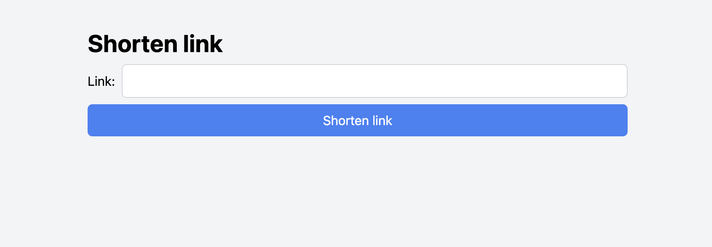

## About Link Shortener

Used tech stack

- Laravel
- Vue.js
- Inertia.js
- Tailwind CSS
- MySQL

## Installation

1. Clone the repo using 
` git clone https://github.com/viktorasbuivydas/link-shortener.git `
2. Go to the project folder
` cd link-shortener `
3. Install composer dependencies
` composer install `
4. Install frontend dependencies
` yarn install `
5. Copy .env.example to .env
` cp .env.example .env `
6. Generate application key
` php artisan key:generate `
7. Create database and fill in .env file
8. Run migrations
` php artisan migrate `
9. Run the application
` php artisan serve `
10. Open the application in browser
` http://localhost:8000 `

## Features

- Create short link
- Open short link
- Validate if link is threat
